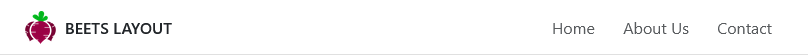
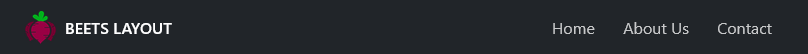
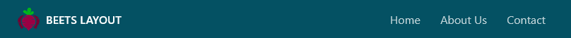
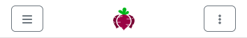
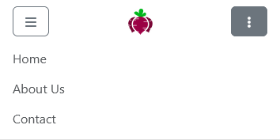

## Structure

```html
<header class="bl__header">
	<div class="header__logo">
		
	</div>
	<div class="header-collapse" id="collapseId">
		<!-- Navigation here -->
	</div>
</header>
```

## Styling

`#!css .header-dark`

Beets Layout does not implement "themes" but you can still do some easy styling to make the header look like you want.

By default the header is white with dark text. You can invert the text colors to work on a darker background by adding the `#!css .header-dark` class to `#!css .bl__header`. You can then add a background color using Bootstrap classes or your own custom css. This is by the way how Bootstrap styles their navigation component.

=== "Default"

	<div class="image" markdown>
	
	</div>

	```html
	<aside class="bl__header">
		...
	</aside>
	```

=== "Dark"

	<div class="image" markdown>
	
	</div>
	Using the Bootstrap class `#!css .bg-dark`.
	```html
	<aside class="bl__header header-dark bg-dark">
		...
	</aside>
	```

=== "Custom"

	<div class="image" markdown>
	
	</div>

	```html
	<aside class="bl__header header-dark" style="background-color: #045163;">
		...
	</aside>
	```

## Placement

`#!css .header-sticky`

By default the header is following the scroll of the page, meaning that it will no longer be visible when scrolling on tall pages. If you want the header to remain at the top of the viewport while scrolling, you can add the class `#!css .header-sticky` to `#!css .bl__header`.

```html
<header class="bl__header header-sticky">
	...
</header>
```

## Collapsible content

The header features a collapsible content section that can be used for i.e. navigations. When the viewport is smaller than the breakpoint, the collapsible section is hidden. It can be toggled on or off using the JavaScript function `#!js toggleHeader()`.

When the toggleHeader() function is activated, the `#!css .header-collapse` will expand inside of the `#!css .bl__header` on a new row (e.g. below the logotype).

=== "Desktop"

	<div class="image" markdown>
	
	</div>

=== "Mobile collapsed"

	<div class="image" markdown>
	
	</div>

=== "Mobile expanded"

	<div class="image" markdown>
	
	</div>

```html
<header class="bl__header justify-content-between">
				
	<button class="btn btn-outline-secondary d-lg-none" onclick="toggleSidebar()">...</button>

	<div class="header__logo">
		
		<span class="d-none d-lg-inline text-uppercase fw-semibold ms-2">Beets Layout</span>
	</div>
	
	<button class="btn btn-outline-secondary d-lg-none" onclick="toggleHeader('header-nav')">...</button>

	<div class="header-collapse" id="header-nav">
		...
	</div>

</header>
```

## Navigation

The navigation section is just an unordered list with list items that contains links. All elemnts are styled so that they can be [collapsed](#collapsible-content) and viewed properly on smaller devices.

The navigation also honors the `#!css .header-dark` styling.

```html
<header class="bl__header">
	<div class="header-collapse" id="header-nav">

		<nav class="header__nav">
			<ul class="nav-list">
				<li class="nav-item"><a href="#" class="nav-link active">Home</a></li>
				<li class="nav-item"><a href="#" class="nav-link">About Us</a></li>
				<li class="nav-item"><a href="#" class="nav-link">Contact</a></li>
			</ul>
		</nav>

	</div>

</header>
```