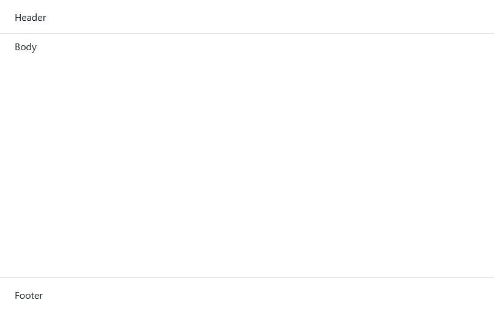

## Structure

The main section is a wrapper for the main site components `#!css .bl__header`, `#!css .bl__body` and `#!css .bl__footer`. It has no styling applied as default.

When a sidebar is used, the `#!css .bl__main` will get an offset to the sidebar with `#!scss margin-left: $sidebar-width;`. When the sidebar is collapsed on smaller viewports, the offset is removed to fill the viewport horizontally.

<div class="image" markdown>

</div>

```html
<main class="bl__main">
	<header class="bl__header">...</header>	
	<div class="bl__body">...</div>
	<footer class="bl__footer">...</footer>
</main>
```