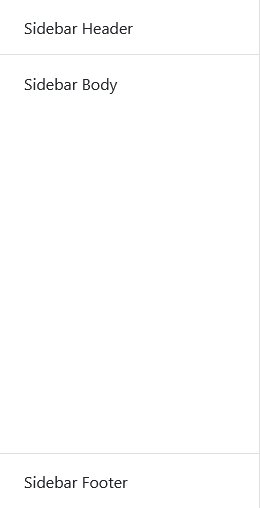
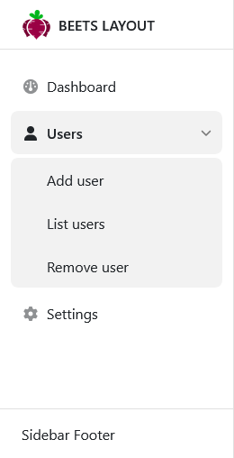
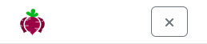
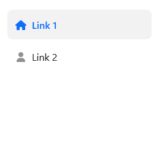
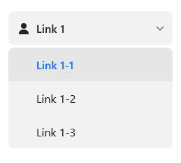
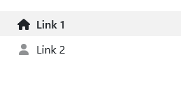
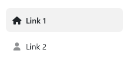
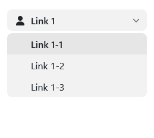

The sidebar stretches from top to bottom of the viewport and is rendered before the `#!css .bl__main` section.

## Structure

Inside the sidebar there are tree sections that can contain different content: `#!css .bl__header`, `#!css .bl__body` and `#!css .bl__footer`.

<div class="image" markdown>

</div>

```html
<aside class="bl__sidebar">

	<div class="sidebar__header">
		<div class="header__logo">
			
		</div>
	</div>

	<div class="sidebar__body">
		<nav class="sidebar__nav">
			<!-- Navigation here -->
		</nav>
	</div>

	<div class="sidebar__footer">
		Sidebar Footer
	</div>

</aside>
```

## Collapsible sidebar

By default the sidebar will not collapse on smaller viewports. If you want that functionality, you need to add the class `#!css .sidebar-collapse` to `#!css .bl__sidebar`.

```html
<aside class="bl__sidebar sidebar-collapse">
	...
</aside>
```

## Styling

`#!css .sidebar-dark`

Beets Layout does not implement "themes" but you can still do some easy styling to make the sidebar look like you want.

By default the sidebar is white with darker elements. You can invert the colors to work on a darker background by adding the `#!css .sidebar-dark` class to `#!css .bl__sidebar`. You can then add a background color using Bootstrap classes or your own custom css.

=== "Default"

	<div class="image" markdown>
	
	</div>

	```html
	<aside class="bl__sidebar">
		...
	</aside>
	```

=== "Dark"

	<div class="image" markdown>
	
	</div>
	Using the Bootstrap class `#!css .bg-dark`.
	```html
	<aside class="bl__sidebar sidebar-dark bg-dark">
		...
	</aside>
	```

=== "Custom"

	<div class="image" markdown>
	
	</div>

	```html
	<aside class="bl__sidebar sidebar-dark" style="background-color: #045163;">
		...
	</aside>
	```

## Header

The sidebar header can for instance contain a logotype and a close button (`#!js toggleSidebar()`) for when the sidebar is visible on small devices.

The following examples are using Bootstrap.

=== "Desktop"

	<div class="image" markdown>
	
	</div>

=== "Mobile expanded"

	<div class="image" markdown>
	
	</div>

```html
<div class="sidebar__header justify-content-between">
	<div class="header__logo">
		
		<span class="d-none d-lg-inline text-uppercase fw-semibold ms-2">
			Beets Layout
		</span>
	</div>
	<button class="btn btn-outline-secondary d-lg-none" onclick="toggleSidebar()">
		...
	</button>
</div>
```

## Body

This is the body and main content of the sidebar. You can place whatever you like in here but navigations and "call to actions" are probably most common.

### Divider

If you want to divide content, like two navigations or a cta and a navigation, you can use a `#!html <hr>` tag with the `#!css .sidebar__divider` class.

```html
<button>Button</button>

<hr class="sidebar__divider">

<nav class="sidebar__nav">
	...
</nav>
```

## Navigation

The navigation section is placed inside `#!css .sidebar__body`. There can be multiple navigations in the sidebar body.

```html
<div class="sidebar__body">
	<nav class="sidebar__nav">
		...
	</nav>
</div>
```

### Structure

Add the `#!css .active` class to a `#!html <a class="nav_link"></a>` to style it as active.

<div class="image" markdown>

</div>

```html
<nav class="sidebar__nav">
	<ul class="nav-list">
		<li class="list-item">
			<a href="#" class="nav-link active">
				<div class="nav-link-icon">...</div>
				Link 1
			</a>
		</li>
		<li class="list-item">
			<a href="#" class="nav-link">
				<div class="nav-link-icon">...</div>
				Link 2
			</a>
		</li>
	</ul>
</nav>
```

### Styling

There are a few built in styles to choose from as well as selecting an accent color that the `#!css .active` class uses.

#### Accent colors

To use an accent color on active items, just add the class `#!css .nav-accent-*` to `#!css .sidebar__nav`. You can choose from the Bootstrap contextual colors och set your own. You don't need Bootstrap to choose these colors since they are hard coded in Beets Layout.

These are the accent colors you can choose from:

| Class      | Color                          |
| ----------- | ------------------------------------ |
| `#!css .nav-accent-primary`   | <div style="background-color: #0d6efd; color: white;" markdown>Blue</div> |
| `#!css .nav-accent-secondary` | <div style="background-color: #6c757d; color: white;" markdown>Gray</div> |
| `#!css .nav-accent-success`   | <div style="background-color: #198754; color: white;" markdown>Green</div> |
| `#!css .nav-accent-warning`   | <div style="background-color: #ffc107;" markdown>Yellow</div> |
| `#!css .nav-accent-danger`    | <div style="background-color: #dc3545; color: white;" markdown>Red</div> |
| `#!css .nav-accent-info`      | <div style="background-color: #0dcaf0;" markdown>Light blue</div> |
| `#!css .nav-accent-light`     | <div style="background-color: #f8f9fa;" markdown>Light gray</div> |
| `#!css .nav-accent-dark`      | <div style="background-color: #212529; color: white;" markdown>Dark gray</div> |
| `#!css .nav-accent-beets`     | <div style="background-color: #9a0044; color: white;" markdown>Crimson</div> |

=== "Default"

	<div class="image" markdown>
	
	</div>

=== "Rounded"

	<div class="image" markdown>
	
	</div>

=== "Default submenu"

	<div class="image" markdown>
	
	</div>

=== "Rounded submenu"

	<div class="image" markdown>
	
	</div>

```html
<nav class="sidebar__nav nav-accent-primary">
	...
</nav>
```

You can add your own accent color by adding some custom css. You can either change the css value `#!css --bl-custom-accent` in `#!css :root` or, if you use the source files, change the scss variable `#!scss $nav-accent-custom-color` in the file `beets-layout/_variables.scss`, then use the class `#!css .nav-accent`.

=== "CSS var()"

	```css
	:root {
		--bl-custom-accent: #d63384;
	}
	```

=== "SCSS variable"

	```scss
	$nav-accent-custom-color: var(--bl-custom-accent);
	```

```html
<nav class="sidebar__nav nav-accent">
	...
</nav>
```

#### Compact & rounded

If you have many links in your navigation of if you have a secondary navigation that should be more subtle, you can use the compact style navigation. Add the class `#!css .nav-compact` to `#!css .sidebar__navigation`.

There is also a rounded style that has a more modern feel to it. Add the class `#!css .nav-rounded` to `#!css .sidebar__navigation`

=== "Default"

	<div class="image" markdown>
	
	</div>
	```html
	<nav class="sidebar__nav">
		...
	</nav>
	```

=== "Compact"

	<div class="image" markdown>
	
	</div>
	```html
	<nav class="sidebar__nav nav-compact">
		...
	</nav>
	```

=== "Rounded"

	<div class="image" markdown>
	
	</div>
	```html
	<nav class="sidebar__nav nav-rounded">
		...
	</nav>
	```

=== "Compact + rounded"

	<div class="image" markdown>
	
	</div>
	```html
	<nav class="sidebar__nav nav-compact nav-rounded">
		...
	</nav>
	```

### Submenus

You can add a one level submenu to your `#!css .list-item`. When you click on the link, the submenu opens. When you click one of the submenu links, the submenu stays open. This can be achieved by adding `#!css .open` to the `#!css .list-item`, `#!css .active` to the main `#!css .nav-link` and the submenu `#!css .nav-link`.

You also has to add `#!css .nav-link__submenu` to the main `#!css .nav-link` to give it the arrow indicating that there is a submenu within.

Give the main `#!css .nav-link` an id (`#!html id="submenu-id"`) and add the JavaScript function: `#!html onclick="toggleSubmenu('submenu-id')"` to connect the to each other.

=== "Default"

	<div class="image" markdown>
	
	</div>

=== "Compact"

	<div class="image" markdown>
	
	</div>

=== "Rounded"

	<div class="image" markdown>
	
	</div>

=== "Compact + rounded"

	<div class="image" markdown>
	
	</div>

```html
<nav class="sidebar__nav">
	<ul class="nav-list">
		<li class="list-item open">
			<a href="#" class="nav-link nav-link__submenu active" id="link-1-submenu" onclick="toggleSubmenu('link-1-submenu')">
				<div class="nav-link-icon">..</div>
				Link 1
			</a>
			<ul class="nav-list__submenu">
				<li class="list-item"><a href="#" class="nav-link active">Link 1-1</a></li>
				<li class="list-item"><a href="#" class="nav-link">Link 1-2</a></li>
				<li class="list-item"><a href="#" class="nav-link">Link 1-3</a></li>
			</ul>
		</li>
	</ul>
</nav>
```

## Footer

The footer section can be used for various things like logged in user info, call to actions and callouts. Therefore it is not styled in any particular way, you must style it as you seem fit.

```html
<div class="sidebar__footer">
	...
</div>
```